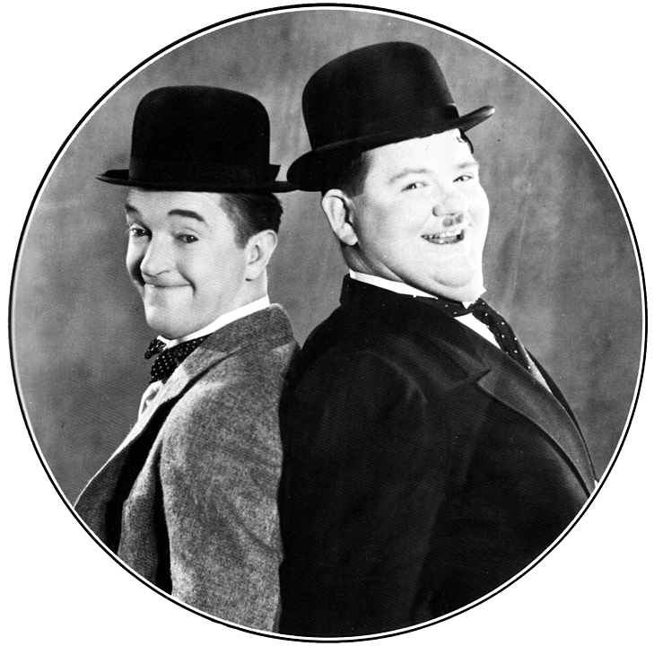
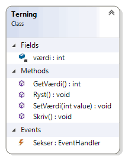
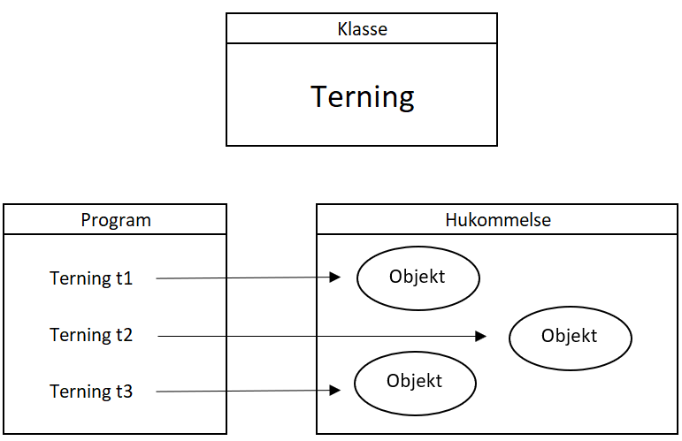
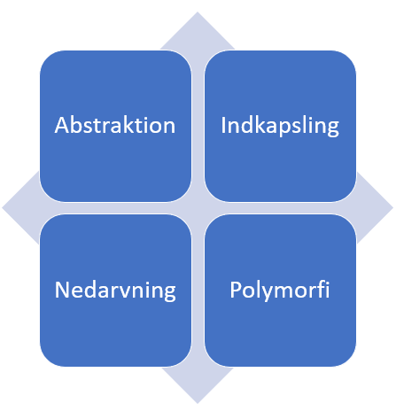
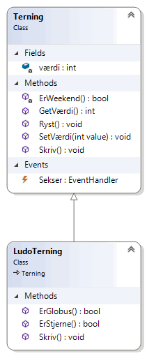

# Objektorienteret programmering

_Online forløb afviklet i marts/april 2020 af Michell Cronberg._

## Objektorienterede principper

<a target="_blank" href="https://www.youtube.com/watch?v=oK4U_QxM-Dk"></a>

### Paradigmer

OOP er en metode til at strukturere kode og er et af flere programmeringsparadigmer

- Iterativ
  - Første versioner af ASM/COBOL
- Proceduralt
  - ASM/Visual Basic
- Objektorienteret
  - Smalltalk, Erlang
- Funktionsorienteret
  - Haskell
- Opmærkningsorienteret
  - SQL

De fleste moderne sprog som C#, Java, Dart mv benytter elementer fra alle paradigmer.

### Værktøj til forståelse af OOP

I mine år som instruktør har jeg fundet et par gode værktøjer som kan hjælpe med at forstå grundlaget, pricipperne og slutteligt koden bag objektorienteret programmering.

Det ene er at benytte terninger af forskelig art


Billede af <a href="https://pixabay.com/da/users/472301-472301/?utm_source=link-attribution&amp;utm_medium=referral&amp;utm_campaign=image&amp;utm_content=812111">Shahid Abdullah</a> fra <a href="https://pixabay.com/da/?utm_source=link-attribution&amp;utm_medium=referral&amp;utm_campaign=image&amp;utm_content=812111">Pixabay</a>

De er meget simple men kan alligevel beskrive alle aspekter inden for OOP. Og så er det noget fysisk du kan kan stående på dit bord eller have i lommen. Alle gamle tricks relateret til hukommelse og abstraktion må bruges - og dette er et af dem.

Det andet er at se den kode der bliver udviklet som noget du udvikler til dig selv, men i stedet noget du udvikler til et team.



Billede af <a href="https://commons.wikimedia.org/wiki/File:Laurel_and_Hardy.png">Hal Roach Studios / Public domain / WikiPedia</a>

Jeg plejer at henvise til to imaginære udviklere Svend og Bent, hvor det typisk er Svend der skriver kode som Bent benytter - men du kan finde dine egne. Meningen er, at du skal kunne se den kode der bliver skrevet som noget der bruges af flere udviklere.

### Objektorienteret design

I OOP forsøger man at opdele en applikation i klasser, der har sit eget afgrænsede ansvarsområde og funktionalitet. Hvis du skal kode et Yatzy spil vil du sikkert på et whiteboard eller stykke papir kunne finde afgrænsede elementer som spillet består af:

- Yatzy
  - Terning
  - Bæger
  - Pointtavle
  - Spiller
  - Regler
  - Spilflow
- Shop
  - Kunde
  - Vare
  - Lager
  - Faktura
  - FakturaLinje
- Vagtplan
  - Medarbejder
  - Leder
  - Butikker
  - Åbningstider

Der findes en masser af værktøjer til at beskrive elementer (typisk klasser) i en applikation, men du har sikkert hørt om [UML](https://da.wikipedia.org/wiki/UML) (Unified Modeling Language) i løbet af din uddannelse.


Fra WikiPedia: <a href="https://commons.wikimedia.org/wiki/File:UML_Diagrams.jpg" title="via Wikimedia Commons">Kishorekumar 62</a> / <a href="http://creativecommons.org/licenses/by-sa/3.0/">CC BY-SA</a>

### Klasser

I de fleste sprog kan du opfatte en klasse (class) som en skabelon for hvad et element (entitet) skal bestå af (data - som også betegnes som felter/fields) og fungere (metoder/methods). I mange sprog kan man ligeledes i klasse beskrive hvad et element skal reagere på (hændelser/events).

Så et Yatzy spil vil typisk bestå af klasser relateret til førnævnte liste - herunder en terning

- Felter
  - Værdi (1-6)
- Metoder
  - Tildel og aflæs værdi
  - Ryst (ny tilfældig værdi)
  - Skriv (skriv værdi til konsol)
- Hændelser
  - Sekser (når der bliver rystet en terning så ...)



<details><summary>Hvis du er nysgerrig kan se koden bag terningen her, men det er ikke væsentligt lige nu. Du vil senere lære at skrive koden selv.</summary>

```csharp
public class Terning
{
    private int værdi;
    public event EventHandler Sekser;

    public void SetVærdi(int value)
    {
        this.værdi = value;
    }

    public int GetVærdi()
    {
        return this.værdi;
    }

    public void Skriv()
    {
        Console.WriteLine($"[{this.værdi}]");
    }

    public void Ryst()
    {
        this.værdi = new Random().Next(1, 7);
        if (this.værdi == 6)
            Sekser?.Invoke(this, new EventArgs());
    }
}
```

</details>

### Instanser

En klasse er en skabelon for instanser - i OOP også kaldet objekter. Man kan typisk (men ikke altid) skal så mange instanser af klassen man ønsker, og **de er alle ens** bortset fra objekternes data (felter).

#### Terning

Så fem instanser af en terning er helt ens bortset fra værdien. De fem terninger bliver af runtime placeret i hukommelsen, og der er gjort plads til et heltal (værdi) samt lidt overhead til at identificere klassen. Metoder og hændelser er placeret et helt andet sted, og ved afvikling arbejder de på objekts data (felter).



## De fire objektorienterede principper



Det klassiske eksamensspørgsmål er "Bekriv med egne ord de fire grundlæggende principper i objektorienteret programmering", og det hurtige svar er

- Abstraktion
  - Hvis Svend benytter en klasse til at beskrive en Terning behøver Bent ikke forstå hvordan terningen fungerer. Han skal bare have et simpelt _interface_ at arbejde med, men i virkeligheden kan der være en masse kode i terningen som er skjult for Bent.
    - Værdi
    - Ryst
    - Skriv
  - Andre eksempler er "byg-selv-computer", kaffemaskiner, mobiltelefoner mv
- Indkapsling
  - Er typisk relateret til data som man ønsker at beskytte således, at der ikke tildeles en forkert værdi eller aflæses uden at have rettigheder til det
    - Der må kun tildeles værdier fra 1-6
    - Terning må kun aflæses på hverdage
- Nedarvning
  - En super effektiv måde at genbruge kode. Sålænge du kan opbygge et hierarki af klasser som går fra at være generel til at være specifik giver det en masse muligheder.
    - En (super) terning kan indgå i et hieraki således, at du på to måder kan skabe en terning til at spille Ludo. For en ludoterning **er** en terning med alt hvad du definerer som generelt, men ludoterning har en lidt udvidet eller tilrettet funktionalitet
      - ErStjerne()
      - ErGlobus()
- Polymorfi
  - Det sværeste begreb og forstå (og kode) men handler om, at et objekt kan have mange former afhængig af hvilken variabeltype der benyttes sålænge variabeltypen er højere i hirarkiet end objektet (fordi et barn i et hierarki **er** jo en mor - med eventuelle tilføjelser)
    - En ludoterning er en terning og har dermed metoder som terning har - herunder en Skriv. Men skriv fungerer anderledes i en ludoterning end i en terning
      - ternings Skriv() = [ 1 ][ 2 ] [ 3 ][ 4 ] [ 5 ][ 6 ]
      - ludoternings Skriv() = [ 1 ][ 2 ] [ S ][ 4 ] [ G ][ 6 ]
    - Men kompiler/runtime er ligeglad med om der ligger en terning eller ludoterning i hukommelsen hvis referencen er gemt i en variabel af typen terning eller ludoterning. I koden kalder du blot Skriv, og så skal runtime nok finde den rigtige metode at afvikle

## Opgaver

### Find de objektorienterede principper

Der er en enkelt og simpel opgave som ikke kræver noget kode forståelse fra din side. Du skal blot se ovenstående video, sætte video på pause ind i mellem, og gentage det jeg gør på din egen maskine. På den måde kan du måske identificere de forskellige objektorienterede principper, og det er vigtigt du gør det selv - også selv kodeforståelsen ikke er så stor. I de efterfølgende moduler begynder du at kode selv.

Den kode jeg kopierer ind i projektet er her:

```csharp
using System;

namespace Demo
{
    internal class Program
    {
        private static void Main(string[] args)
        {
            // Her starter program


            // Her slutter program
        }
    }

    public class Terning
    {

        private int værdi = 1;
        public event EventHandler Sekser;

        public void SetVærdi(int value)
        {
            if (value < 1 || value > 6)
            {
                Console.WriteLine("Forkert værdi - skal være mellem 1 og 6. Sat til 1");
                value = 1;
            }
            this.værdi = value;
        }

        public int GetVærdi()
        {
            if (ErWeekend())
                Console.WriteLine("Hov - må ikke benyttes i en weekend");
            return this.værdi;
        }

        private bool ErWeekend()
        {
            if (DateTime.Now.DayOfWeek == DayOfWeek.Sunday || DateTime.Now.DayOfWeek == DayOfWeek.Saturday)
                return true;
            else
                return false;
        }

        public virtual void Skriv()
        {
            Console.WriteLine($"Jeg er en terning med værdien [ { this.GetVærdi()} ]");
        }


        public void Ryst()
        {
            this.værdi = new Random().Next(1, 7);
            if (this.værdi == 6)
                Sekser?.Invoke(this, new EventArgs());
        }

    }

    public class LudoTerning : Terning
    {
        public bool ErStjerne()
        {
            return this.GetVærdi() == 3;
        }
        public bool ErGlobus()
        {
            return this.GetVærdi() == 3;
        }

        public override void Skriv()
        {
            if (this.GetVærdi() == 3)
                Console.WriteLine($"Jeg er en ludoterning med værdien [ S ]");
            else if (this.GetVærdi() == 5)
                Console.WriteLine($"Jeg er en ludoterning med værdien [ S ]");
            else
                Console.WriteLine($"Jeg er en ludoterning med værdien [ { this.GetVærdi()} ]");
        }

    }

}
```

Kode skaber til orientering følgende hierarki:


