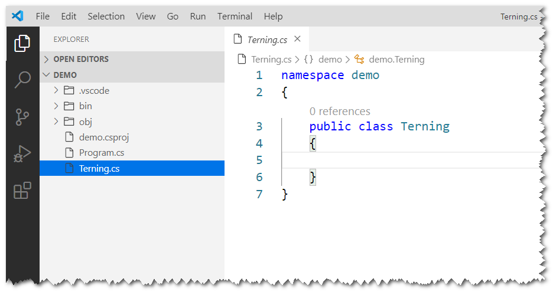
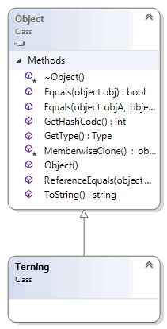
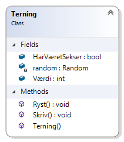

# Objektorienteret programmering

_Online forløb afviklet i marts/april 2020 af Michell Cronberg._

<a target="_blank" href="https://youtu.be/isD5O2QRoxs"></a>

# Klasser

En klasse (class) er altså en skabelon for instanser/objekter, og i C\# erklæres den således:

```csharp
class Terning
{
  // medlemmer
}
```

## Placering af klasser

Normalt placeres klasser på namespace niveau.

Det kan enten ske i Program.cs:

```csharp
using System;

namespace Demo
{
    class Program
    {
        static void Main(string[] args)
        {

        }
    }

    class Terning {}

}
```

eller i en fil for sig selv



Bare sørg for at namespace er ens så du slipper for en ekstra reference:

```csharp
namespace demo
{
    public class Terning
    {

    }
}
```

## Brug af new

Med mindre man tilføjer yderligere kode skal man benytte `new` kodeordet til at skabe instanser, og gemme referencen i en variabel af den korrekte type

```csharp
Terning t1;
t1 = new Terning();

// eller

Terning t2 = new Terning();

```

Man kan muligvis undre sig lidt over, at objektet allerede består af forskellige metoder som ToString, Equals mv, men det skyldes at alle objekter automatisk arver fra en klasse i frameworket (System.Object):



### Referencetype

Det er vigtigt at forstå, at en klasse er en referencetype, og der dermed i variabler ikke opbevares værdier men referencer (vi kigger på hukommelsesteori senere). En referencetype indikerer samtidigt, at en variabel kan få en `null` værdi hvilket betyder at den ikke indeholder noget (ikke peger på noget). Derfor risikerer du at løbe ind i en NullReferenceException:

```csharp
string a = "mathias";           // string = System.String = klasse
Console.WriteLine(a.ToUpper());
a = null;
Console.WriteLine(a.ToUpper()); // FEJL
```

Det samme gælder variabler af egne klasser:

```csharp
Terning t;          // t = null
t = new Terning();  // t indeholder en reference
t = null;           // t = null igen
```

### Nullable reference types

I de nyeste versioner af C\# kan man få lidt ekstra hjælp til mulige null-problemer som kan slåes til på flere måder - nemmest direkte i koden:

```csharp
#nullable enable
```

Det vil advare mod eventuelle problemer (ikke fejle - advare).

### Brug af new

Det klassiske spørgsmål...

```csharp
// hvorfor kan man følgende uden af bruge new
int i = 10; // syntaks sukker
// man må også gerne bruge new
int j = new Int();  // Opretter ny instans og sætter default værdi
j = 10;

// PS i øvrigt er int en struct og ikke en class
// men det har ikke nogen betydning her

```

Lige nu skal du bare benytte new til at skabe instanser af både Microsofts og egne klasser/strukturer.

## Felter

Et felt er en klasses data og i virkeligheden der der fylder i hukommelsen - resten er overhead der beskrivelse af type mv. Du kan bare se det som variabler, og du kan benytte enhver type.

```csharp
class Terning
{
  int værdi;
  System.DateTime tidForSidsteRyst;
  bool harVæretSekser;
  // Andre felter
}
```

Hvis ikke du angiver feltets _synlighed_ er det som standard privat.

```csharp
class Terning
{
  private int værdi;
  private System.DateTime tidForSidsteRyst;
  private bool harVæretSekser;
  // Andre felter
}
```

Alle felter bør være private fordi det er den eneste måde vi kan indkapsle data. Men du må gerne gøre dem offentlige (men vi er tæt på medarbejdersamtale - smiler). I følgende kode kan alle felter tildeles en tilfældig værdi.

```csharp
class Terning
{
  public int Værdi;
  public System.DateTime TidForSidsteRyst;
  public bool HarVæretSekser;
  // Andre felter
}
```

Normalt er offentligt medlemmer navngivet med et stort bogstav til at starte med.

Fordi felter nu er offentlige kan de tilgås udefra (husk - Svend koder Terningen og Bent bruger den):

```csharp
using System;

namespace Demo
{
    internal class Program
    {
        private static void Main(string[] args)
        {
            Terning t = new Terning();
            // Værdi kan få en værdi mellem -2.2 milliard og +2.2 milliard - det duer jo ikke
            t.Værdi = 2;
            // Det giver jo ikke nogen mening at man må dette
            t.HarVæretSekser = true;
            t.TidForSidsteRyst = DateTime.Now;

        }

    }

    class Terning
    {
        public int Værdi;
        public System.DateTime TidForSidsteRyst;
        public bool HarVæretSekser;
        // Andre felter
    }
}
```

I næste modul retter vi op på de offentligt felter - det duer altså ikke - men for nu tillader vi det (men husk - medarbejdersamtalen lurer!).

## Konstruktører

En konstruktør (constructor) er kode der afvikles når du benytter new, og findes i to versioner

- standard konstruktør (default constructor)
- brugerdefineret konstruktør (custom constructor)

### Standard konstruktør

En standard konstruktør er uden argumenter:

```csharp
class Terning
{
    public Terning()
    {

    }
}
```

Den kan benyttes til at afvikle al slags kode men typisk bruges den til initialisering af data. Det giver eksempelvis ingen mening at en værdi starter med 0 - enten skal den starte med 1-6

```csharp
class Terning
{
    public int Værdi;
    public Terning()
    {
        this.Værdi = 1;
    }
}
```

eller måske med en tilfældig værdi?

```csharp
class Terning
{
    public int Værdi;
    public Terning()
    {
        this.Ryst();
    }

    public void Ryst()
    {
        this.Værdi = new Random().Next(1, 7);
    }
}
```

Men du kan skrive hvilken som helst kode du har lyst til i en konstruktør.

### Brugerdefineret konstruktør

Med en standard konstruktør (eller i stedet for) kan du tilføje en eller flere brugerdefinerede konstruktører. I modsætning til en standard konstruktør har en brugerdefineret konstruktør argumenter:

```csharp
using System;

namespace Demo
{
    internal class Program
    {
        private static void Main(string[] args)
        {
            Terning t = new Terning(5);
        }

    }

    class Terning
    {
        public int Værdi;
        public Terning(int værdi)
        {
            if (værdi < 1 || værdi > 6)
                værdi = 1;
            this.Værdi = værdi;
        }
    }
}
```

Nu skal man som det fremgår oprette en terning med en værdi - alt andet fejler.

Du må dog gerne have både en standard og (evt flere) brugerdefineret konstruktører:

```csharp
using System;

namespace Demo
{
    internal class Program
    {
        private static void Main(string[] args)
        {
            Terning t1 = new Terning();     // Tilfældig værdi
            Terning t2 = new Terning(5);    // 5
        }

    }

    class Terning
    {
        public int Værdi;
        public Terning(int værdi)
        {
            if (værdi < 1 || værdi > 6)
                værdi = 1;
            this.Værdi = værdi;
        }

        public Terning()
        {
            Ryst();
        }

        public void Ryst()
        {
            this.Værdi = new Random().Next(1, 7);
        }
    }
}
```

### this

Hvis man har flere konstruktører kan man eventuelt benytte this-kodeordet til at afvikle andre konstruktører.

## Destruktører

En klasse kan også have en destruktør

```csharp
class Terning
{
    // Konstruktør
    public Terning()
    {

    }

    // Destruktør
    ~Terning()
    {

    }
}
```

Men det bruges ikke meget fordi den først kører når objektet fjernes fra hukommelsen og afvikles i øvrigt på en separat tråd. Se evt. [using](https://docs.microsoft.com/en-us/dotnet/csharp/language-reference/keywords/using-statement).

## Opgave: Simpel (data) klasse

I denne opgave skal du blot skabe en simpel data klasse (udelukkende felter), der kan opbevare data på en person, og du må gerne i denne opgave benytte offenlige felter. Klassen skal hedde Person og skal indeholde felter som

- Navn (string)
- Højde (int)
- ErDansk (bool)
- FødselsDato (DateTime)

Klassen skal have en standard konstruktør som initialiserer felterne Navn til "" og ErDansk til true. Samtidigt skal der udskrives "Person oprettet" på konsolen når der bliver oprettet et objekt.

Den skal kunne bruges som følger:

```csharp
Person p = new Person();
p.Navn = "Mathias";
p.Højde = 170;
p.FødselsDato = new DateTime(2006, 1, 24);

Console.WriteLine($"{p.Navn} er født i {p.FødselsDato.Year}");
```

hvilket skal resulterer i følgende:

```
Person oprettet
Mathias er født i 2006
```

### Løsning

<details><summary>Her er min løsning</summary>

```csharp
using System;

namespace Demo
{
    class Program
    {
        static void Main(string[] args)
        {

            Person p = new Person();
            p.Navn = "Mathias";
            p.Højde = 170;
            p.FødselsDato = new DateTime(2006, 1, 24);

            Console.WriteLine($"{p.Navn} er født i {p.FødselsDato.Year}");
        }
    }

    class Person
    {
        public string Navn;
        public bool ErDansk;
        public int Højde;
        public DateTime FødselsDato;

        public Person()
        {
            this.ErDansk = true;
            this.Navn = "";
            Console.WriteLine("Person oprettet");
        }
    }
}
```

</details>

## Opgave: Simpel terning

Du skal skabe en terning med følgende medlemmer

- et felt Værdi der kan indeholde en int - må gerne være offentlig i denne opgave
- et felt HarVæretSekser der kan indeholde en bool - må gerne være offentlig i denne opgave
- et felt random af typen System.Random (tilfældige tal). Felter skal være privat - må ikke tilgås udefra
- en Ryst- der finder et tilfældigt tal mellem 1-6 og tildeler til Værdi
  - Se evt. løsning hvor jeg benytter Systen.Random objektet
  - Husk at sætte HarVæretSekser hvis der rystes til en sekser
- en Skriv-metode der udskriver eksempelvis `[6] - har været sekser = True` eller `[1] - har været sekser = False`
- en konstruktør som skaber et nyt objekt af System.Random
  - `random = new System.Random`



Du kan teste terningen med følgende:

```csharp
Terning t = new Terning();
t.Skriv();
t.Ryst();
t.Skriv();
```

som kan resultere i eksempelvis

```
[5] - har været sekser = False
[6] - har været sekser = True
```

Prøv og med en løkke for at ryste terningen mange gange.

#### Løsning

<details><summary>Her er min løsning</summary>

```csharp
using System;

namespace Demo
{
    internal class Program
    {
        private static void Main(string[] args)
        {
            Terning t = new Terning();
            t.Skriv();
            t.Ryst();
            t.Skriv();
        }
    }

    class Terning
    {

        public int Værdi;
        public bool HarVæretSekser;
        private Random random;

        public void Ryst()
        {
            this.Værdi = random.Next(1, 7);
            if (this.Værdi == 6)
                this.HarVæretSekser = true;
        }

        public void Skriv()
        {
            Console.WriteLine($"[{this.Værdi}] - har været sekser = { this.HarVæretSekser }");
        }

        public Terning()
        {
            this.random = new System.Random();
            this.Ryst();
        }
    }
}
```

</details>
