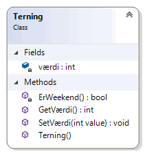
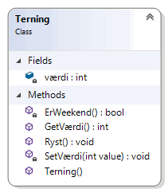
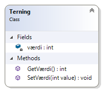
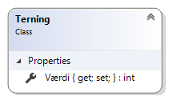
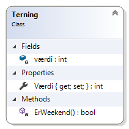
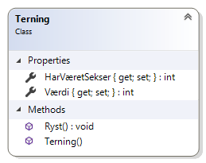
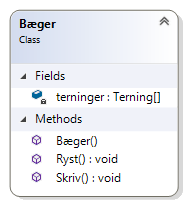

# Objektorienteret programmering

*Online forløb afviklet i marts/april 2020 af Michell Cronberg.*

## Indkapsling

<a target="_blank" href="https://www.youtube.com/watch?v=NbLxoOhtFSk"></a>

Et af de store principper i OOP er indkapsling hvilket typisk handler om at beskytte felter. Det gælder om at styre tildeling og aflæsning.

Indkapsling består af de ting

- at gøre felter private
- at skabe metoder til tildeling og aflæsning

### Private felter

I sidste modul var alle felter offentilge og det duer ikke

> Offentlige felter = medarbejdersamtale (smiler)

Så i stedet for dette

```csharp
class Terning
{
  public int Værdi;
}
```

gør du dette

```csharp
class Terning
{
  private int værdi;  
  
  public Terning()
  {
    this.værdi = 1;
  }
}
```

Private felter starter typisk med lille bogstav, men dette er også brugt

```csharp
class Terning
{
  private int _værdi;  

  public Terning()
  {
    this._værdi = 1;
  }
}
```

Under alle omstændigheder er det nu blot et felt der kun kan tilgås i klassen og ikke udefra. Husk - det er nemmere at forstå hvis du tænker på at det er Svend der skaber klassen, og Bent der bruger den!

### Get/Set metoder

Da felterne nu er private og ikke kan tilgås bliver du nødt til at "slå hul" med metoder.

```csharp
class Terning
{
    private int værdi;

    public int GetVærdi()
    {
        return this.værdi;
    }

    public void SetVærdi(int value)
    {
        this.værdi = value;
    }

    public Terning()
    {
        this.værdi = 1;
    }
}
```


Metoderne sætter blot værdi og aflæser værdi, men pointen med brug af metoder er at du kan vælge at tilføje

- valideringskode
- logkode
- sikkerhedskode
- initialiseringskode

som du ønsker. 

Hvad følgende med følgende hvor der kontrolleres om værdi er korrekt ved tildeling, og der kontrolleres om det er en hverdag ved aflæsning

```csharp
using System;

namespace Demo
{
    internal class Program
    {
        private static void Main(string[] args)
        {
            Terning t = new Terning();
            Console.WriteLine(t.GetVærdi());    // 1
            t.SetVærdi(6);
            Console.WriteLine(t.GetVærdi());    // 6

            // t.SetVærdi(7);                      // FEJL
            // int v = t.GetVærdi();               // Hvis weekend - så fejl!
        }
    }

    class Terning
    {
        private int værdi;

        public int GetVærdi()
        {
            if (this.ErWeekend())
                throw new Exception("Terning må kun bruges på hverdage!");
            return this.værdi;
        }

        public void SetVærdi(int value)
        {
            if (value < 1 || value > 6)
                throw new Exception("Terning må kun have en værdi mellem 1-6");
            this.værdi = value;
        }

        private bool ErWeekend()
        {
            if (DateTime.Now.DayOfWeek == DayOfWeek.Saturday || DateTime.Now.DayOfWeek == DayOfWeek.Sunday)
                return true;
            else
                return false;
        }

        public Terning()
        {
            this.SetVærdi(1);
        }
    }
}
```



Du kan også vælge at SetVærdi skal være privat og dermed kun benyttes internet i klassen.

> "Best practice" er typisk, at man ikke internt arbejder direkte på feltet men går gennem metoder

```csharp
using System;

namespace Demo
{
    internal class Program
    {
        private static void Main(string[] args)
        {
            Terning t = new Terning();
            Console.WriteLine(t.GetVærdi());    // 1
            t.Ryst();
            Console.WriteLine(t.GetVærdi());    // 1-6

            // t.SetVærdi(6);                   // Fejl
            // t.SetVærdi(7);                    // FEJL
            // int v = t.GetVærdi();             // Hvis weekend - så fejl!
        }
    }

    class Terning
    {
        private int værdi;

        public int GetVærdi()
        {
            if (this.ErWeekend())
                throw new Exception("Terning må kun bruges på hverdage!");
            return this.værdi;
        }

        private void SetVærdi(int value)
        {
            if (value < 1 || value > 6)
                throw new Exception("Terning må kun have en værdi mellem 1-6");
            this.værdi = value;
        }

        private bool ErWeekend()
        {
            if (DateTime.Now.DayOfWeek == DayOfWeek.Saturday || DateTime.Now.DayOfWeek == DayOfWeek.Sunday)
                return true;
            else
                return false;
        }

        public void Ryst()
        {
            Random rnd = new Random();
            this.SetVærdi(rnd.Next(1, 7));
        }

        public Terning()
        {
            this.SetVærdi(1);
        }
    }
}
```



## Egenskaber

Get/Set metoder er brugt i mange objektorienterede sprog, med C# har en yderligere medlemstype kaldet egenskaber (properties). De findes også i sprog som Python, JavaScript, Delphi, VB med videre.

### Automatiske egenskaber

Ideen med egenskaber (properties) er at gøre syntaksen pænere, samt definere en ny medlemstype som ikke er relateret til metoder. Det giver en del muligheder - herunder databinding. Men selv om syntaksen er anderledes er princippet præcis det samme - et privat felt og tilhørende get/set medlemmer.

Således er følgende

```csharp
using System;

namespace Demo
{
    internal class Program
    {
        private static void Main(string[] args)
        {
            Terning t = new Terning();
            t.SetVærdi(6);
            Console.WriteLine(t.GetVærdi());    // 6
        }
    }

    class Terning
    {
        private int værdi;

        public int GetVærdi()
        {
            return this.værdi;
        }
        public void SetVærdi(int value)
        {
            this.værdi = value;
        }
    }
}
```



det samme som 

```csharp
using System;

namespace Demo
{
    internal class Program
    {
        private static void Main(string[] args)
        {
            Terning t = new Terning();
            t.Værdi = 6;
            Console.WriteLine(t.Værdi);    // 6
        }
    }

    class Terning
    {
        public int Værdi { get; set; }
    }
}
```




men bemærk, at syntaksen er meget pænere - både i klassen og i brugen af terningen. Med denne syntaks autogeneres både felt og get/set metoder i kompileringen.

Du kan eventuelt vælge at gøre set-delen privat

```csharp
    class Terning
    {
        public int Værdi { get; private set; }
    }
```

### Almindelige egenskaber

Hvis du ønsker at tilføje kode til get/set delen bliver du nødt til at kode lidt mere - herunder tilføje feltet selv. 

Således kan dette

```csharp
using System;

namespace Demo
{
    internal class Program
    {
        private static void Main(string[] args)
        {
            Terning t = new Terning();
            t.SetVærdi(6);
            Console.WriteLine(t.GetVærdi());    // 6
        }
    }

    class Terning
    {
        private int værdi;

        public int GetVærdi()
        {
            if (this.ErWeekend())
                throw new Exception("Terning må kun bruges på hverdage!");
            return this.værdi;
        }

        public void SetVærdi(int value)
        {
            if (value < 1 || value > 6)
                throw new Exception("Terning må kun have en værdi mellem 1-6");
            this.værdi = value;
        }

        private bool ErWeekend()
        {
            if (DateTime.Now.DayOfWeek == DayOfWeek.Saturday || DateTime.Now.DayOfWeek == DayOfWeek.Sunday)
                return true;
            else
                return false;
        }
    }
}
```


ændres til 

```csharp
using System;

namespace Demo
{
    internal class Program
    {
        private static void Main(string[] args)
        {
            Terning t = new Terning();
            t.Værdi = 6;
            Console.WriteLine(t.Værdi);    // 6
        }
    }

    class Terning
    {
        private int værdi;


        public int Værdi
        {
            get
            {
                if (this.ErWeekend())
                    throw new Exception("Terning må kun bruges på hverdage!");
                return this.værdi;
            }
            set
            {
                if (value < 1 || value > 6)
                    throw new Exception("Terning må kun have en værdi mellem 1-6");

                this.værdi = value;
            }
        }

        private bool ErWeekend()
        {
            if (DateTime.Now.DayOfWeek == DayOfWeek.Saturday || DateTime.Now.DayOfWeek == DayOfWeek.Sunday)
                return true;
            else
                return false;
        }
    }
}
```



Bemærk, at du nu selv skal tilføje feltet men har mulighed for at tilføje den kode du ønsker!

## Opgave: Terning

I denne opgave skal du skabe en ny konsol applikation og tilføje en terning med

- en automatisk egenskab Værdi (int). Man må kun kunne tildele værdi internt (private set)
- en automatisk egenskab HarVæretSekser (bool). Man må kun kunne tildele værdi internt (private set)
- en Ryst-metode der ryster terningen og tildeler værdi. Hvis værdi = 6 så husk at tildel HarVæretSekser en true værdi
  - ```this.Værdi = new Random().Next(1,7);```
- en standard konstruktør der ryster terningen



Den skal kunne testes således:

```csharp
Terning t = new Terning();
Console.WriteLine(t.Værdi);
t.Ryst();
Console.WriteLine(t.Værdi);            
Console.WriteLine("Har været sekser?: " + t.HarVæretSekser);
```

### Løsning

<details><summary>Her er min løsning</summary>

```csharp
using System;

namespace Demo
{
    internal class Program
    {
        private static void Main(string[] args)
        {
            Terning t = new Terning();
            Console.WriteLine(t.Værdi);
            t.Ryst();
            Console.WriteLine(t.Værdi);
            Console.WriteLine("Har været sekser?: " + t.HarVæretSekser);
        }
    }

    class Terning
    {
        public int Værdi { get; private set; }
        public bool HarVæretSekser { get; private set; }

        public void Ryst()
        {
            this.Værdi = new Random().Next(1, 7);
            if (this.Værdi == 6)
                this.HarVæretSekser = true;
        }
        public Terning()
        {
            this.Ryst();
        }
    }
}
```
</details>

### Ekstra opgave

Hvis du har lyst kan du også skabe en klasse Bæger med

- Array af fem terninger
- En Ryst-metode der ryster alle terninger
- En konstruktør som opretter terninger i bæger og ryster dem
- En Skriv-metode der udskriver bægeret



Bægeret skal virke således:

```csharp
Bæger b = new Bæger();
b.Skriv();              // x x x x x (fem tilfældige tal)
b.Ryst();
b.Skriv();              // x x x x x (fem tilfældige tal)
```

### Løsning

<details><summary>Her er min løsning</summary>

```csharp
using System;

namespace Demo
{
    internal class Program
    {
        private static void Main(string[] args)
        {
            Bæger b = new Bæger();
            b.Skriv();              // x x x x x (fem tilfældige tal)
            b.Ryst();
            b.Skriv();              // x x x x x (fem tilfældige tal)
        }
    }

    class Terning
    {
        public int Værdi { get; private set; }
        public bool HarVæretSekser { get; private set; }

        public void Ryst()
        {
            this.Værdi = new Random().Next(1, 7);
            if (this.Værdi == 6)
                this.HarVæretSekser = true;
        }
        public Terning()
        {
            this.Ryst();
        }
    }

    class Bæger
    {

        private Terning[] terninger;

        public void Ryst()
        {
            if (this.terninger == null)
                return;
            foreach (var terning in this.terninger)
                terning.Ryst();

        }
        public Bæger()
        {
            terninger = new Terning[5];
            for (int i = 0; i < 5; i++)
                terninger[i] = new Terning();
        }

        public void Skriv()
        {
            foreach (var terning in this.terninger)
            {
                Console.Write(terning.Værdi + " ");
            }
            Console.WriteLine();
        }
    }
}
```
</details>