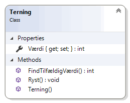
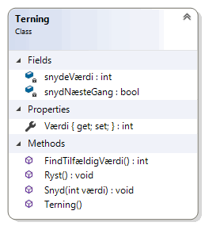

# Objektorienteret programmering

_Online forløb afviklet i marts/april 2020 af Michell Cronberg._

<a target="_blank" href="https://youtu.be/A9IOfe_EbOc"></a>

## Metoder

Metoder i en klasse repræsenterer de ting man kan gøre med objektet, og er typisk relateret til objektets data (felter).

Blot for en god ordens skyld - en metode i C\# er som følger:

```
[synlighed] [[statisk]] [returtype] Navn ([argumenter - type navn])
{
    // kode
    // return ...
}
```

De skal placeres enten i en klasse eller en struktur.

### Synlighed

En metode kan enten være

- offentlig (public)
- privat (private)
- protected (se senere)

### Flow

Det klassiske eksamensspørgsmål i grundlæggende programmering. Hvad skriver denne app ud

```csharp
using System;

namespace Demo
{
    internal class Program
    {
        private static void Main(string[] args)
        {
            Test t = new Test();
            t.Metode1();
        }
    }

    class Test
    {
        public void Metode1()
        {
            Console.WriteLine("Start Metode1");
            Metode2();
            Console.WriteLine("Slut Metode1");
        }
        public void Metode2()
        {
            Console.WriteLine("Start Metode2");
            Metode3();
            Console.WriteLine("Slut Metode2");
        }
        public void Metode3()
        {
            Console.WriteLine("Start Metode3");
            Metode4();
            Console.WriteLine("Slut Metode3");
        }
        public void Metode4()
        {
            Console.WriteLine("Start Metode4");
            Console.WriteLine("Slut Metode4");
        }
    }
}
```

Overvej... Prøv det selv...

<details><summary>Her er svaret</summary>

```csharp
Start Metode1
Start Metode2
Start Metode3
Start Metode4
Slut Metode4
Slut Metode3
Slut Metode2
Slut Metode1
```

</details>

### Eksempler på definering og kald

Her er nogle eksempler på metoder

```csharp
using System;

namespace Demo
{
    internal class Program
    {
        private static void Main(string[] args)
        {
            Test t = new Test();
            t.Metode1();
            t.Metode2();
            t.Metode3(1, 1, true);
            int a = 1, b = 2;
            bool c = true;
            t.Metode3(a, b, c);

            int res1 = t.Metode4();
            t.Metode4();              // returværdi ignoreres

            int res2 = t.Metode5(2, 5);
            int res3 = t.Metode6(6, 7);
        }
    }

    public class Test {
        public void Metode1()
        {

        }

        // Brug af return
        public void Metode2()
        {
            // kode
            if (true)
                return;

            // kode
        }

        // Argumenter
        public void Metode3(int a, int b, bool c)
        {
            // a, b og c lever udelukkende i metoden

            // Se dog senere omkring værdi- og reference
            // baserede variabler
        }

        // Returtype
        public int Metode4()
        {
            // Skal indeholde en return
            return 1;
        }

        // Returtype med argumenter
        public int Metode5(int a, int b)
        {
            return a + b;
        }

        // Returtype med argumenter (brug af return)
        public int Metode6(int a, int b)
        {
            if (a < 10)
                return a + b;
            else
                return a * b;
        }
    }

}
```

## Statiske metoder (medlemmer)

En statisk metode er en metode som ikke er relateret til instanser men til selve typen. Den er således typisk brugt som hjælpemetoder der har et eller andet at gøre med typen.

Der er masser af eksempler på statiske metoder i frameworket

```csharp
System.Console
System.Math
System.IO.File
```

og du kan nemt skabe dem selv

```csharp
using System;

namespace Demo
{
    internal class Program
    {
        private static void Main(string[] args)
        {
            Test t = new Test();
            t.Metode1();

            Test.Metode2();
        }
    }

    class Test
    {
        public void Metode1()
        {
            Console.WriteLine("I Metode1");
        }

        public static void Metode2()
        {
            Console.WriteLine("I Metode2");
        }
    }
}
```

Her er et eksempel på en terning med en statisk metode:

```csharp
using System;

namespace Demo
{
    internal class Program
    {
        private static void Main(string[] args)
        {
            Terning t = new Terning();
            Console.WriteLine(t.Værdi);

            int v = Terning.FindTilfældigVærdi();
            Console.WriteLine(v);

        }
    }

    class Terning
    {
        public int Værdi { get; private set; }
        public void Ryst()
        {
            this.Værdi = Terning.FindTilfældigVærdi();
        }
        public Terning()
        {
            this.Ryst();
        }

        public static int FindTilfældigVærdi() {
            return new Random().Next(1, 7);
        }

    }
}
```



Bemærk hvordan FindTilfældigVærdi bliver kaldt, og at den gerne må bruges fra instansmedlemmer.

## Yderligere

Der er en del features relateret til metoder i C\# som du kan læse op på

- standard værdier til argumenter
- overload
- navngivning argumenter
- yield
- rekursive metoder
- tuples

## Opgave: Terning

I denne opgave skal du skabe en ny konsol applikation og tilføje en terning med

- en automatisk egenskab Værdi (int). Man må kun kunne tildele værdi internt (private set)
- en Ryst-metode der ryster terningen og tildeler værdi.
  - brug `this.Værdi = new Random().Next(1,7);`
- en standard konstruktør der ryster terningen
- en metode Snyd der tager en int som argument, og husker denne værdi til næste gang Ryst bliver kaldt. Næste gang Ryst kaldes skal den ikke "snyde" længere. Så du må skabe et eller flere private felter til at holde styr på snyd-værdien
- en statisk metode FindTilfældigtTal som blot returnerer en int med et tilfældigt tal mellem 1-6. Metoden skal i øvrigt benyttes af Ryst.

Den skal kunne testes således:

```csharp
Terning t = new Terning();
Console.WriteLine(t.Værdi); // tilfædigt tal

int v = Terning.FindTilfældigVærdi();   // tilfædigt tal
Console.WriteLine(v);

t.Snyd(5);
t.Ryst();
Console.WriteLine(t.Værdi); // 5
t.Ryst();
Console.WriteLine(t.Værdi); // tilfædigt tal
```

### Løsning

<details><summary>Her er min løsning</summary>

```csharp
using System;

namespace Demo
{
    internal class Program
    {
        private static void Main(string[] args)
        {
            Terning t = new Terning();
            Console.WriteLine(t.Værdi); // tilfædigt tal

            int v = Terning.FindTilfældigVærdi();   // tilfædigt tal
            Console.WriteLine(v);

            t.Snyd(5);
            t.Ryst();
            Console.WriteLine(t.Værdi); // 5
            t.Ryst();
            Console.WriteLine(t.Værdi); // tilfædigt tal
        }
    }

    class Terning
    {
        public int Værdi { get; private set; }

        private int snydeVærdi;
        private bool snydNæsteGang;

        public void Ryst()
        {
            this.Værdi = FindTilfældigVærdi();
            if (snydNæsteGang)
            {
                this.Værdi = snydeVærdi;
                snydNæsteGang = false;
            }
        }
        public Terning()
        {
            this.Ryst();
        }
        public static int FindTilfældigVærdi()
        {
            return new Random().Next(1, 7);
        }

        public void Snyd(int værdi)
        {
            if (værdi > 1 && værdi < 6)
            {
                snydNæsteGang = true;
                snydeVærdi = værdi;
            }
        }


    }
}
```



</details>
