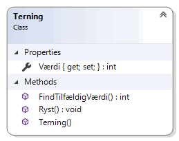
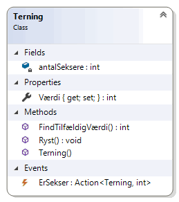
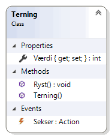

# Objektorienteret programmering
*Online forløb afviklet i marts/april 2020 af Michell Cronberg.*

<a target="_blank" href="http://youtu.be/E7Aocm1Q0PM?hd=1"></a>

## Hændelser

Hændelser er den sidste medlemstype i klasser/strukturer

- Felter
- Egenskaber
- Metoder
- Hændelser

og giver mulighed for at objekter kan afvikle noget kode.

Prøv følgende kode

```csharp
using System;

namespace Demo
{
    internal class Program
    {
        private static void Main(string[] args)
        {
            int antalSeksere = 0;
            Terning t = new Terning();
            for (int i = 0; i < 25; i++)
            {
                if (t.Værdi == 6)
                {
                    antalSeksere++;
                    Console.WriteLine($"Der har været {antalSeksere} 6'{(antalSeksere == 1 ? "er" : "ere")}");
                    Console.Beep();                    
                }

                Console.WriteLine(t.Værdi);
                t.Ryst();
            }

        }
    }

    class Terning
    {
        public int Værdi { get; private set; }

        public void Ryst()
        {
            this.Værdi = FindTilfældigVærdi();
        }
        public Terning()
        {
            this.Ryst();
        }
        public static int FindTilfældigVærdi()
        {
            return new Random().Next(1, 7);
        }

    }
}
```



og sammenlign med denne kode

```csharp
using System;

namespace Demo
{
    internal class Program
    {
        private static void Main(string[] args)
        {

            Terning t = new Terning();
            t.ErSekser += MinErSekserMetode;
            for (int i = 0; i < 10; i++)
            {
                Console.WriteLine(t.Værdi);
                t.Ryst();
            }

        }

        private static void MinErSekserMetode(Terning terning, int antalSeksere)
        {
            Console.WriteLine($"Der har været {antalSeksere} 6'{(antalSeksere == 1 ? "er" : "ere")}");
            Console.Beep();
        }
    }

    class Terning
    {
        public int Værdi { get; private set; }
        public event Action<Terning, int> ErSekser;

        private int antalSeksere;

        public void Ryst()
        {
            this.Værdi = FindTilfældigVærdi();
            if (this.Værdi == 6)
            {
                antalSeksere++;
                if (ErSekser != null)
                    ErSekser.Invoke(this, antalSeksere);
            }
        }
        public Terning()
        {
            this.Ryst();
        }
        public static int FindTilfældigVærdi()
        {
            return new Random().Next(1, 7);
        }

    }
}
```



Kan du se forskellen? I den første app er det udvikleren som benytter terningen der skal må sørge for at checke om der rystes en sekser, og også tælle antal seksere op. I den anden app der denne funktionalitet en del af terningen, og udvikleren som benytter terningen skal blot tage stilling til hvilken metode der skal afvikles **når** der bliver rystet en sekser, og **hvad** der skal ske. 

Med hændelser kan du placere logikken i klassen, og lade brugere binde metoder til konkrete hændelser.

### Timer

Her er et andet klassisk eksempel fra frameworket - afvikling af kode med jævne mellemrum

```csharp
using System;
namespace Demo
{
    internal class Program
    {
        private static void Main(string[] args)
        {
            System.Timers.Timer t = new System.Timers.Timer();
            t.Enabled = true;
            t.Interval = 1000;  // 1 sek
            t.Elapsed += Tick;
            Console.ReadLine();
        }
        private static void Tick(object sender, System.Timers.ElapsedEventArgs e)
        {
            Console.WriteLine("Tick");
        }
    }
}
```

Koden i Tick-metoden afvikles hvert sekund. 

Her er samme kode nu blot med en Lambda-metode men præcis samme funktionalitet:

```csharp
using System;
namespace Demo
{
    internal class Program
    {
        private static void Main(string[] args)
        {
            System.Timers.Timer t = new System.Timers.Timer();
            t.Enabled = true;
            t.Interval = 1000;  // 1 sek
            t.Elapsed += (s, e) => Console.WriteLine("Tick"); 
            Console.ReadLine();
        }
    }
}
```

## Delegate


Billede af <a href="https://pixabay.com/users/geralt-9301/?utm_source=link-attribution&amp;utm_medium=referral&amp;utm_campaign=image&amp;utm_content=4817430">Gerd Altmann</a> fra <a href="https://pixabay.com/?utm_source=link-attribution&amp;utm_medium=referral&amp;utm_campaign=image&amp;utm_content=4817430">Pixabay</a>

- En delegate i C\# er en speciel type der fungerer som en skabelon for objekter. 
- Objektet kan indeholde en eller flere referencer til en metode med samme signatur.
- En delegate er en referencetype og referencer til objekter kan dermed ses som andre referencer
  - gem
  - argument
  - returværdi

Typen er ret kompleks og kan oprettes på flere måder, men i sin helt grundlæggende form skal du forstå at et objekt af en delegate

- indeholder en liste af reference til metoder med samme signatur
- har en Invoke metode til at afvikle en eller flere metoder
- har en GetInvocationList der returnerer en liste af referencer til samtlige metoder
- benytter += til at tilføje referencer
- benytter -= til at fjerne reference

### Definering

En delegate kan defineres ved hjælp af delegate kodeordet, men det er der ikke så mange der bruger i nyere C\#. Her benytter man i stedet 

- Action\<T\>-typen som repræsenterer en metode uden returværdi (void)
  - Hvor T repræsentere listen af argumenter
- Func\<T\>-typen som repræsenterer en metode med en returværdi
  - Hvor T repræsentere listen af argumenter **samt** returværdi
- Predicate\<T\>-typen som repræsenterer en metode der altid returnerer en bool og tager et enkelt argument
  - Hvor T repræsenterer typen af det enkelte argument

```csharp
Action f1;                      // Metode uden returværdi og uden argumenter
Action<string> f2;              // Metode uden returværdi og med et string argument
Action<string, int> f3;         // Metode uden returværdi og med string og int argumenter

Func<int> f4;                   // Metode der returnerer en int
Func<int, int> f5;              // Metode der returnerer en int og med int argument
Func<string, bool, string> f6;  // Metode der returnerer en string med string og bool argument

Predicate<int> f7;              // Metode der returnerer en bool og tager en int som argument
Predicate<string> f8;           // Metode der returnerer en bool og tager en string som argument
Predicate<DateTime> f9;         // Metode der returnerer en bool og tager en DateTime som argument
```

Variablerne kan nu tildeles referencer til delegate-objekter, der indeholder en liste af referencer til metoder med samme signatur.

```csharp
using System;
namespace Demo
{
    internal class Program
    {
        private static void Main(string[] args)
        {
            Action f1 = M1;
            Action<string> f2 = M2;
            Func<int> f3 = M3;
            Func<int, int> f4 = M4;
            Predicate<int> f5 = M5;
        }

        private static void M1() { }
        private static void M2(string a) { }
        private static int M3()
        {
            return 1;
        }
        private static int M4(int a)
        {
            return a;
        }

        private static bool M5(int a)
        {
            return a;
        }
    }
}
```

Her efter kan en metode både afvikles direkte eller inddirekte gennem en delegate.

```csharp
using System;
namespace Demo
{
    internal class Program
    {
        private static void Main(string[] args)
        {
            Action f1 = M1;

            // Direkte
            M1();

            // Inddirekte (med eller uden Invoke)
            f1.Invoke();
            f1();
        }

        private static void M1() {
            Console.WriteLine("I M1");
        }
    }
}
```

Men i modsætning til de rå metoder kan variabler som indeholder en reference til en delegate sendes med til andre metoder eller gemmes til senere brug.

```csharp
using System;
namespace Demo
{
    internal class Program
    {
        private static void Main(string[] args)
        {
            Action f1 = M1;
            Test(f1);
            
            Console.WriteLine();

            // Eller

            Test(M1);
        }

        private static void M1() {
            Console.WriteLine("I M1");
        }

        private static void Test(Action f) {
            Console.WriteLine("Start Test");
            f?.Invoke();    // kald Invoke hvis f != null
            Console.WriteLine("Slut Test");
        }
    }
}
```

## Hændelser

En hændelse er i sidste ende blot en (typisk Action) delegate som er tilføjet event-kodeordet. At gøre en delegate til et "event" beskytter den på en speciel måde, og fortæller andre der benytter objektet at dette er en hændelse (ligesom egenskaber i virkeligheden er get/set metoder).

Det ligner et offenligt felt som vi jo så gerne vil undgå - men er i virkeligheden noget der bliver beskyttet af event-kodeordet.

```csharp
using System;
namespace Demo
{
    internal class Program
    {
        private static void Main(string[] args)
        {

            Test t = new Test();
            t.Hændelse1 += Metode1;
            t.Hændelse2 += Metode2;
            t.Hændelse3 += Metode3;
            t.PrøvHændelser();
        }

        public static void Metode1()
        {
            Console.WriteLine("Metode1");
        }
        public static void Metode2(int a)
        {
            Console.WriteLine("Metode2");
        }
        public static void Metode3(int a, int b, int c)
        {
            Console.WriteLine("Metode3");
        }
    }

    class Test
    {
        public event Action Hændelse1;
        public event Action<int> Hændelse2;
        public event Action<int, int, int> Hændelse3;

        public void PrøvHændelser()
        {
            Hændelse1?.Invoke();
            Hændelse2?.Invoke(1);
            Hændelse3?.Invoke(1, 2, 3);
        }
    }
}
```

Koden i PrøvHændelser() kunne også være skrevet som

```csharp
if(Hændelse1 != null)
    Hændelse1();
// ...
```

Det er vigtigt at checke om værdien er nul.

## Opgave: Terning

I denne opgave skal du skabe en ny konsol applikation og tilføje en terning med

- en automatisk egenskab Værdi (int). Man må kun kunne tildele værdi internt (private set)
- en Ryst-metode der ryster terningen og tildeler værdi.
  - brug `this.Værdi = new Random().Next(1,7);`
- en standard konstruktør der giver tegningen en værdi på 1 som standard
- en hændelse Sekser som blot er en void uden argumenter (Action). Den skal afvikles når der rystes en sekser

Den skal kunne testes således (her her jeg valgt at sige en lyd når der slås en sekser - prøv selv forskellige ting)

```csharp
private static void Main(string[] args)
{
    Terning t = new Terning();
    t.Sekser += ErSekser;

    for (int i = 0; i < 10; i++)
    {
        t.Ryst();
        Console.WriteLine(t.Værdi);
    }

    t.Sekser = null;

}

private static void ErSekser() {
    Console.Beep();
}
```

### Løsning

<details><summary>Her er min løsning</summary>

```csharp
using System;

namespace Demo
{
    internal class Program
    {
        private static void Main(string[] args)
        {
            Terning t = new Terning();
            t.Sekser += ErSekser;

            for (int i = 0; i < 10; i++)
            {
                t.Ryst();
                Console.WriteLine(t.Værdi);
            }

            t.Sekser = null;

        }

        private static void ErSekser() {
            Console.Beep();
        }
    }

    class Terning
    {
        public int Værdi { get; private set; }
        public event Action Sekser;

        public void Ryst()
        {
            this.Værdi = new Random().Next(1, 7);
            if (this.Værdi == 6)
                Sekser?.Invoke();
        }
        public Terning()
        {
            this.Værdi = 1;
        }
    }
}
```



</details>
