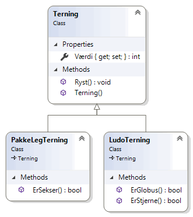

# Objektorienteret programmering
*Online forløb afviklet i marts/april 2020 af Michell Cronberg.*

<a target="_blank" href="https://youtu.be/zqJvh_tAgjY"></a>

## Nedarvning

Brug af arv i objektorienterede sprog er en at de mest effektive metoder til genbrug. Det går i sin enkelthed ud på, at en klasse med offentlige eller beskyttede medlemmer kan nedarve sin funktionalitet til underklasser.

Man vil altid kunne se et arvehieraki fra generelle typer til specialicerede typer, og vil altid kunne sige, at en underklasse **er** en overklasse - et barn **er** en mor. Kompileren vil sørge for, at runtime er 100% sikker på, at en metode i mor **altid** findes i børn. Det er grundreglen for arv.

I C\# arbejder man med klasser som kun kan have en mor - det kan være anderledes i andre sprog.


## Syntaks

Man benytter kolon (:) til nedarvning

```csharp
// Mor-Barn
class Mor { }
class Barn : Mor { }

// Dyr
class Dyr { }
class Hvirveldyr : Dyr { }
class Hvirvelløse : Dyr { }
class Fisk : Hvirveldyr { }
class Torsk : Fisk { }
class Pattedyr : Hvirveldyr { }
class Elefant : Pattedyr { }
class Bløddyr : Hvirvelløse { }
class Musling : Bløddyr { }

// Personer
class Person { }
class Medarbejder : Person { }
class Kursist : Person { }
class Instruktør : Medarbejder { }
class FremmødeKursist : Kursist { }
class OnlineKursist : Kursist { }
class HjælpeInstruktør : Instruktør { }
```

## Arv

Alt hvad der findes i mor findes også i sine børn. Børn kan have egne medlemmer eller tilrettelser til medlemmer fra mor polymorfi

```csharp
using System;

namespace Demo
{
    internal class Program
    {
        private static void Main(string[] args)
        {
            Barn b = new Barn();
            b.Metode1();            
        }
    }

    public class Mor
    {
        public void Metode1() { }
    }

    public class Barn : Mor
    {
    }
}
```

## Tilgang til medlemmer

Der er fortsat de to klassiske virkefelter

- public (alle udefra og i hierarki kan tilgå medlem)
- private (kun klassen selv kan tilgå medlem)

men der tilføjes en ny

- protected (alle klasser i hierarki kan tilgå medlem - men ikke udefra)

```csharp
using System;

namespace Demo
{
    internal class Program
    {
        private static void Main(string[] args)
        {
            Barn b = new Barn();
            b.Metode1();
            b.Metode4();
        }
    }


    public class Mor
    {
        public void Metode1() { }
        protected void Metode2() { }
        private void Metode3() { }
    }

    public class Barn : Mor
    {
        public void Metode4() {
            this.Metode1();
            this.Metode2();            
        }
    }
}
```

## Yderligere teori

Der er specielle regler for konstruktører i arvehierarkier - herunder rækkefølgen de bliver afviklet på og brugen af base-kodeordet.

## Opgave: LudoTerning

I denne opgave skal du skabe en ny konsol applikation og tilføje en Terning med

- en automatisk egenskab Værdi (int). Man må kun kunne tildele værdi internt i et hierarki (protected set)
- en Ryst-metode der ryster terningen og tildeler værdi.
  - brug `this.Værdi = new Random().Next(1,7);`
- en standard konstruktør der kalder Ryst

Yderligere skal du skal en klasse LudoTerning som arver fra Terning og har metoderne bool ErStjerne() (true hvis  det er en tre'er) og bool ErGlobus() (true hvis det er en femmer).

Slutteligt en klasse PakkeLegTerning som arver fra Terning med metode MåTagePakke() (true hvis det er en seks'er).



Du kan teste klasserne med følgende:

```csharp
Terning t = new Terning();
Console.WriteLine(t.Værdi);

LudoTerning l = new LudoTerning();
Console.WriteLine(l.Værdi);
Console.WriteLine(l.ErGlobus());
Console.WriteLine(l.ErStjerne());


PakkeLegTerning p = new PakkeLegTerning();
Console.WriteLine(p.Værdi);
Console.WriteLine(p.ErSekser());
```

### Løsning

<details><summary>Her er min løsning</summary>

```csharp
using System;

namespace Demo
{
    internal class Program
    {
        private static void Main(string[] args)
        {

            Terning t = new Terning();
            Console.WriteLine(t.Værdi);

            LudoTerning l = new LudoTerning();
            Console.WriteLine(l.Værdi);
            Console.WriteLine(l.ErGlobus());
            Console.WriteLine(l.ErStjerne());


            PakkeLegTerning p = new PakkeLegTerning();
            Console.WriteLine(p.Værdi);
            Console.WriteLine(p.ErSekser());
        }
    }

    class Terning
    {
        public int Værdi { get; protected set; }

        public void Ryst()
        {
            this.Værdi = new Random().Next(1, 7);
        }
        public Terning()
        {
            this.Ryst();
        }
    }

    class LudoTerning : Terning
    {
        public bool ErStjerne()
        {
            return this.Værdi == 3;
        }

        public bool ErGlobus()
        {
            return this.Værdi == 5;
        }
    }

    class PakkeLegTerning : Terning
    {
        public bool ErSekser()
        {
            return this.Værdi == 6;
        }
    }
}
```

</details>