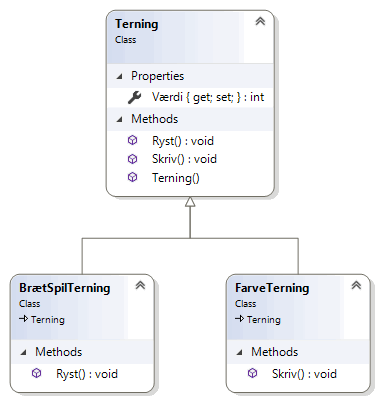

# Objektorienteret programmering
*Online forløb afviklet i marts/april 2020 af Michell Cronberg.*

<a target="_blank" href="http://youtu.be/E7Aocm1Q0PM?hd=1"></a>

## Polymorfi

Polymorfi betyder **mange former** på græsk og er nok et af de sværeste begreber inden for objektorienteret programmering. Begrebet dækker over, at runtime kan se et objekt på flere forskellige måder afhængig af hvilken variabeltype der benyttes.

Hvis vi ser på polymorfi inden for et arvehierarki (for det kan også benyttes med et interface) så er der to forhold der er vigtige:

- Børn kan have sin egen implementation
- En mor kan altid pege på sine børn

## Børn kan have sin egen implementation

Hvis man i "mor" markerer en metode som *virtual* kan børn **vælge** at overskrive den (bemærk - kan vælge - behøver ikke):

Her Skriv-metoden ikke overskrevet i LudoTerning, og derfor kaldes mors Skriv

```csharp
using System;

namespace Demo
{
    internal class Program
    {
        private static void Main(string[] args)
        {

            LudoTerning l = new LudoTerning();
            l.Skriv();                          // [ 1 ] eller [ 2 ] eller [ 3 ] 
                                                // [ 4 ] eller [ 5 ] eller [ 6 ] 
   
        }
    }

    class Terning
    {
        public int Værdi { get; protected set; }

        public void Ryst()
        {
            this.Værdi = new Random().Next(1, 7);
        }
        public Terning()
        {
            this.Ryst();
        }

        public virtual void Skriv() {
            Console.WriteLine($"[ {this.Værdi} ]");
        }
    }

    class LudoTerning : Terning
    {
        public bool ErStjerne()
        {
            return this.Værdi == 3;
        }

        public bool ErGlobus()
        {
            return this.Værdi == 5;
        }
    }
}
```

Men her er den overskrevet - og skriver derfor 1,2,S,4,G,6 og ikke 1,2,3,4,5,6

```csharp
using System;

namespace Demo
{
    internal class Program
    {
        private static void Main(string[] args)
        {

            LudoTerning l = new LudoTerning();
            l.Skriv();                          // [ 1 ] eller [ 2 ] eller [ S ] 
                                                // [ 4 ] eller [ G ] eller [ 6 ] 
        }
    }

    class Terning
    {
        public int Værdi { get; protected set; }

        public void Ryst()
        {
            this.Værdi = new Random().Next(1, 7);
        }
        public Terning()
        {
            this.Ryst();
        }

        public virtual void Skriv() {
            Console.WriteLine($"[ {this.Værdi} ]");
        }
    }

    class LudoTerning : Terning
    {
        public bool ErStjerne()
        {
            return this.Værdi == 3;
        }

        public bool ErGlobus()
        {
            return this.Værdi == 5;
        }

        public override void Skriv()
        {
            if(ErStjerne())
                Console.WriteLine($"[ S ]");
            else if (ErGlobus())
                Console.WriteLine($"[ G ]");
            else
                base.Skriv();   // kald mors Skriv
        }
    }
}
```

Bemærk, at override hænger sammen med virtual.

> Du skal måske også lidt nærmere på abstract-kodeordet når du har lært at bneytte polymorfi!

## En mor kan altid pege på sine børn

Hvis du husker på at et barn altid **er** en mor - den har de samme metoder plus eventuelle tilføjelser - så giver denne kode mening:

```csharp
using System;

namespace Demo
{
    internal class Program
    {
        private static void Main(string[] args)
        {

            Mor a = new Mor();
            a.Metode1();

            Barn b = new Barn();
            b.Metode1();
            b.Metode2();

            Mor c = new Barn();
            c.Metode1();
            // c.Metode2();     Kan ikke tilgås gennem variabeltypen Mor

            // Men nu kan vi
            Barn d = c as Barn;
            d.Metode1();
            d.Metode2();

        }
    }

    class Mor {
        public void Metode1() { }
    }

    class Barn : Mor {
        public void Metode2() { }
    }

}
```

Det kan udnytte i mange situationer hvor man blot ønsker en fælles metode afviklet uden at tage hensyn til typen.

I et specielt brætspil kræves både en terning der kan slå 1, 2 eller 3 og en farveterning (grøn, rød). Det kunne jeg finde på at kode således:

```csharp
using System;

namespace Demo
{
    internal class Program
    {
        private static void Main(string[] args)
        {

            BrætSpilTerning t1 = new BrætSpilTerning();
            t1.Skriv(); // [ 1 ], [ 2 ] eller [ 3 ]
            FarveTerning t2 = new FarveTerning();
            t2.Skriv(); // [ Rød ] eller [ Grøn ]

        }
    }

    class Terning
    {
        public int Værdi { get; protected set; }

        public virtual void Ryst()
        {
            this.Værdi = new Random().Next(1, 7);
        }
        public Terning()
        {
            this.Ryst();
        }

        public virtual void Skriv()
        {
            Console.WriteLine($"[ {this.Værdi} ]");
        }
    }

    class BrætSpilTerning : Terning
    {
        public override void Ryst()
        {
            this.Værdi = new Random().Next(1, 4);   // 1, 2 eller 3
        }
    }

    class FarveTerning : Terning
    {
    
        public override void Skriv()
        {
            if(this.Værdi<4)
                Console.WriteLine($"[ Rød ]");
            else 
                Console.WriteLine($"[ Grøn ]");

        }
    }
}
```

I spillet slår man med begge terninger samtidigt - men det er umuligt at skabe en liste/array af flere typer. Men da mor altid kan pege på sine børn, og der i mor er en Skriv (som måske er overskrevet) og en Ryst kan følgende lade sig gøre:

```csharp
using System;

namespace Demo
{
    internal class Program
    {
        private static void Main(string[] args)
        {
            
            // Bæger til to terninger (bemærk - array af mor)
            Terning[] bæger = new Terning[2];
            bæger[0] = new BrætSpilTerning();
            bæger[1] = new FarveTerning();

            // Så kan vi både ryste og skrive terninger
            foreach (Terning terning in bæger)
                terning.Skriv();

            Console.WriteLine();

            for (int i = 0; i < 5; i++)
            {
                foreach (Terning terning in bæger)
                {
                    terning.Ryst();
                    terning.Skriv();
                }
            }


        }
    }

    class Terning
    {
        public int Værdi { get; protected set; }

        public virtual void Ryst()
        {
            this.Værdi = new Random().Next(1, 7);
        }
        public Terning()
        {
            this.Ryst();
        }

        public virtual void Skriv()
        {
            Console.WriteLine($"[ {this.Værdi} ]");
        }
    }

    class BrætSpilTerning : Terning
    {
        public override void Ryst()
        {
            this.Værdi = new Random().Next(1, 4);   // 1, 2 eller 3
        }
    }

    class FarveTerning : Terning
    {
    
        public override void Skriv()
        {
            if(this.Værdi<4)
                Console.WriteLine($"[ Rød ]");
            else 
                Console.WriteLine($"[ Grøn ]");

        }
    }
}
```



## Opgave: Terning med polymorfi

Du skal skabe en tom konsol app med følgende klasser:

```csharp
internal class Kæledyr {
    public string Navn { get; set; }
    public string Kendelyd() {
        return "?";
    }
}

internal class Fugl : Kæledyr {
    public bool HåndTam { get; set; }
}

internal class Hund : Kæledyr {
    public string HundeRegisterId { get; set; }
}
```

Din opgave er at gøre Kendelyd i Kæledyr virtuel således, at du kan overskrive Kendelyd() i  Fugl og Hund. Fuglen skal sige Pip og hunden Vov. 

Følgende skal virke:

```csharp
Fugl f = new Fugl();
Console.WriteLine(f.Kendelyd());    // Pip
Hund h = new Hund();
Console.WriteLine(h.Kendelyd());    // Vov
```

Som en ekstra opgave kan du evt skabe et array af kæledyr og tilføjes et par fugle og hunde. Herefter skal du løbe dem alle igennem og udskrive Kendelyd().

### Løsning

<details><summary>Her er min løsning</summary>

```csharp
using System;

namespace Demo
{
    internal class Program
    {
        private static void Main(string[] args)
        {

            Fugl f = new Fugl();
            Console.WriteLine(f.Kendelyd());    // Pip
            Hund h = new Hund();
            Console.WriteLine(h.Kendelyd());    // Vov

            Console.WriteLine();
            Console.WriteLine("Ekstra");
            Console.WriteLine();

            Kæledyr[] zoo = new Kæledyr[6];
            zoo[0] = new Fugl();
            zoo[1] = new Hund();
            zoo[2] = new Fugl();
            zoo[3] = new Hund();
            zoo[4] = new Fugl();
            zoo[5] = new Hund();

            foreach (var dyr in zoo)
                Console.WriteLine(dyr.Kendelyd());

        }
    }

    internal class Kæledyr
    {
        public string Navn { get; set; }
        public virtual string Kendelyd()
        {
            return "?";
        }
    }

    internal class Fugl : Kæledyr
    {
        public bool HåndTam { get; set; }
        public override string Kendelyd()
        {
            return "Pip";
        }
    }

    internal class Hund : Kæledyr
    {
        public string HundeRegisterId { get; set; }
        public override string Kendelyd()
        {
            return "Vov";
        }
    }
}
```

</details>